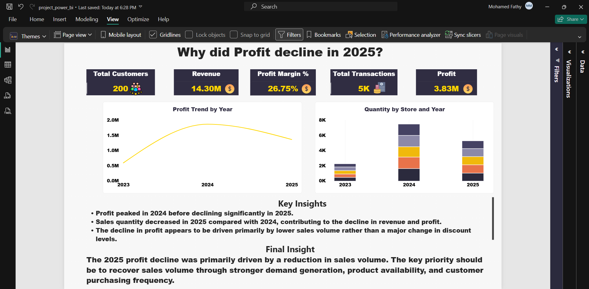
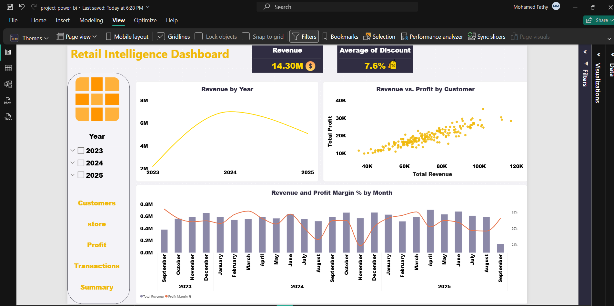
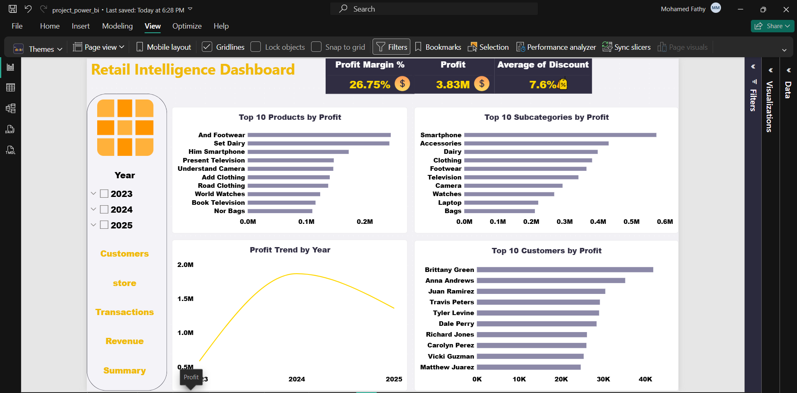
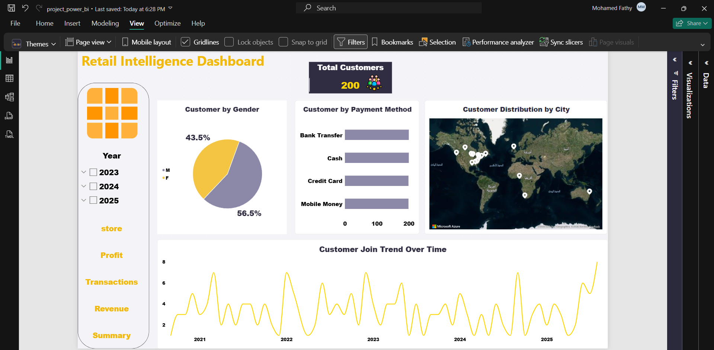
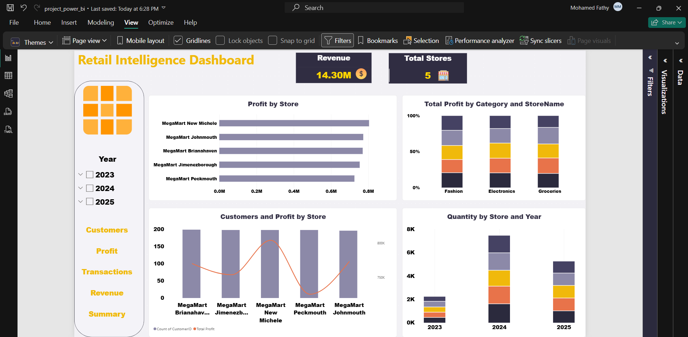
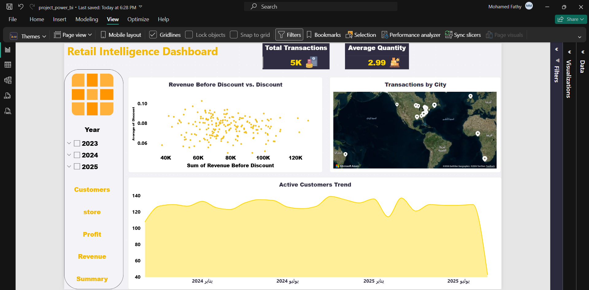

# 📊 Retail Intelligence Dashboard — Power BI

An interactive **Retail Intelligence Dashboard** built with **Microsoft Power BI** to analyze retail performance across revenue, profit, customers, stores, and transactions.

The project focuses on transforming retail data into actionable business insights through interactive dashboards, KPI analysis, trend analysis, geographic analysis, and product performance analysis.

---

## 🎯 Project Overview

The **Retail Intelligence Dashboard** provides a comprehensive view of retail business performance and enables users to explore key metrics across different business dimensions.

The dashboard covers:

* 💰 Revenue Performance
* 📈 Profit & Profit Margin
* 👥 Customer Analysis
* 🏪 Store Performance
* 🛒 Transaction Analysis
* 📦 Product & Subcategory Performance
* 🌍 Geographic Analysis
* 📅 Time-Based Analysis
* 🔎 Top N Performance Analysis

---

## 📌 Dashboard Pages

### 🏠 Summary

Provides a high-level overview of the retail business performance and key KPIs.

### 💰 Revenue

Analyzes revenue performance over time and compares revenue with profitability metrics.

### 📈 Profit

Provides detailed analysis of profit, profit margin, products, and subcategories.

### 👥 Customers

Analyzes customer distribution and customer behavior across different dimensions.

### 🏪 Stores

Evaluates store-level performance using revenue, profit, and customer metrics.

### 🛒 Transactions

Analyzes transaction volume, quantity, payment methods, locations, and transaction-related metrics.

---

## 📊 Key KPIs

The dashboard includes important business KPIs such as:

* **Total Revenue**
* **Total Profit**
* **Profit Margin %**
* **Total Transactions**
* **Average Discount**
* **Average Quantity**
* **Total Customers**
* **Total Stores**

These KPIs help provide a quick overview of overall business performance.

---

## 📈 Key Analysis

The dashboard includes several analytical techniques:

* Revenue & Profit Trend Analysis
* Monthly & Yearly Performance
* Profit Margin Analysis
* Top 10 Products by Profit
* Top 10 Subcategories by Profit
* Store Performance Analysis
* Customer Distribution by City
* Transaction Analysis by City
* Payment Method Analysis
* Revenue vs. Discount Analysis
* Geographic Analysis
* Top N Analysis
* Interactive Filtering & Navigation

---

## 🧠 Business Insights

The dashboard helps answer important business questions such as:

* Which products and subcategories generate the highest profit?
* Which stores contribute the most to business performance?
* How does revenue change over time?
* How does profitability change alongside revenue?
* Where are customers geographically concentrated?
* Which payment methods are most frequently used?
* What is the relationship between discounts and revenue?
* Which areas or stores require further business attention?

---

## 🗂️ Data Model

The Power BI data model contains the main business entities:

* **Customers**
* **Products**
* **Stores**
* **Transactions**
* **Measures**

The model is designed to support interactive analysis across customers, products, stores, transactions, and time.

---

## 🧮 DAX & Measures

The project uses DAX measures to calculate business KPIs and analytical metrics, including:

* Total Revenue
* Total Profit
* Profit Margin %
* Average Discount
* Average Quantity
* Customer Count
* Store Count
* Transaction Count

These measures are used throughout the dashboard to provide dynamic results based on the selected filters and dimensions.

---

## 🎨 Dashboard Design

The dashboard follows a professional **Dark Navy & Gold** theme with:

* Interactive KPI Cards
* Slicers
* Bar & Column Charts
* Line Charts
* Combo Charts
* Scatter Charts
* Azure Maps
* Top N Analysis
* Page Navigation
* Interactive Filtering

The design focuses on clear data visualization and an easy-to-navigate user experience.


---

## 📸 Dashboard Screenshots

### Summary



### Revenue



### Profit



### Customers



### Stores



### Transactions



---

## 🛠️ Tools & Technologies

* **Microsoft Power BI**
* **DAX**
* **Data Modeling**
* **Data Visualization**
* **Power Query**
* **Business Intelligence**
* **Interactive Dashboard Design**

---

## 📁 Project Structure

```text
retail-intelligence-powerbi-dashboard/
│
├── README.md
├── Retail_Intelligence_Dashboard.pbix
│
├── screenshots/
│   ├── summary.png
│   ├── revenue.png
│   ├── profit.png
│   ├── customers.png
│   ├── stores.png
│   └── transactions.png
│
├── assets/
│   └── dashboard-preview.png
```

---

## 🚀 Project Objective

The main objective of this project is to demonstrate how **Power BI, DAX, and Data Modeling** can be used to transform retail data into an interactive business intelligence solution that supports performance monitoring and data-driven decision-making.

---

## 👨‍💻 Author

**Mohamed**

Aspiring Data Analyst | Power BI | Excel | SQL | Data Visualization

---

⭐ If you find this project useful, feel free to explore the dashboard and give the repository a star.
